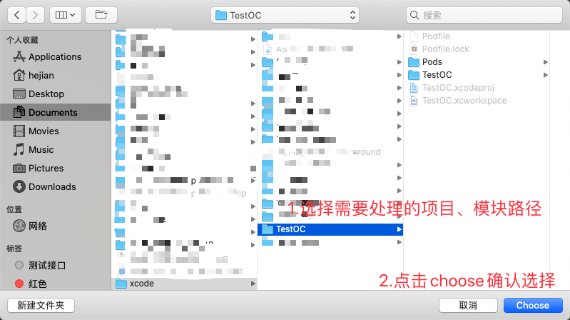

# 项目介绍

运行`main.py`文件后后，会弹出一个选择框，选择当前需要处理的项目，就可以全局替换项目中的`#import`不规范导入方式的文件了

demo：

```objective-c
#import "Masonry.h" // 未处理的的import方式
#import <Masonry/Masonry.h> // 处理后的import方式
```

## 使用方式
运行后弹出选择处理的项目路径：



## Python配置方法
简书 [Python](https://www.jianshu.com/p/171d235dfc1b) 查看运行当前项目的配置方式